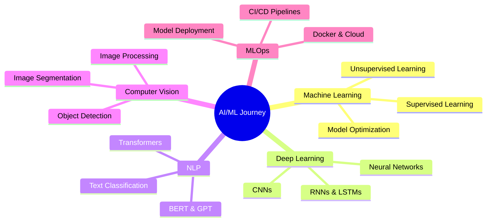

<div align="center">
  
</div>

<div align="center">
  
[](https://git.io/typing-svg)

<p>
  
  
  
  
</p>

</div>

---

## 👋 About Me

<table>
<tr>
<td width="60%">

### 🎓 Background
**AI Student** at Faculty of Artificial Intelligence, South Valley University  
**Third Year** | Aspiring Machine Learning Engineer

### 💡 What I Do
Building cutting-edge ML models and AI-powered applications with focus on:
- 🤖 **Machine Learning & Deep Learning**
- 🗣️ **Natural Language Processing (NLP)**
- 👁️ **Computer Vision**
- ☁️ **MLOps & Model Deployment**

### 🎯 Current Focus
- 🔬 Developing end-to-end ML pipelines
- 📊 Competing in Kaggle competitions
- 🌐 Contributing to open-source AI projects
- 🚀 Building production-ready AI solutions

</td>
<td width="40%">

<div align="center">
  
  
  <br><br>
  
  **🔗 Quick Links**
  
  [](https://www.linkedin.com/in/nada-mohammed5)
  [](https://nada-elbendary.github.io/#projects)
  [](https://www.kaggle.com/nadamohammedahmed)
  [](mailto:nadaelbendary3@gmail.com)
  
</div>

</td>
</tr>
</table>

---

## 🛠️ Tech Stack

<div align="center">

### Languages & Frameworks


### AI/ML Technologies


### Tools & Platforms


</div>

---

## 🌟 Featured Project

<div align="center">

### 🧠 Amazon Sentiment Analysis System
**Advanced ML System for Real-time Customer Review Classification**

[](https://github.com/nada-elbendary/Amazon-Sentiment-Analysis)

</div>

<table>
<tr>
<td width="50%">

#### 🎯 Project Highlights
- **91.13% Classification Accuracy**
- Trained on **500,000+ Amazon reviews**
- Real-time sentiment predictions
- Production-ready Flask API
- Modern responsive web interface
- Advanced NLP preprocessing pipeline

</td>
<td width="50%">

#### 🛠️ Technologies Used
- **ML/NLP:** Scikit-learn, NLTK, TF-IDF
- **Backend:** Python, Flask, Pandas
- **Frontend:** HTML5, CSS3, Bootstrap
- **Deployment:** RESTful API Architecture

#### 📊 Impact
Enables businesses to understand customer sentiment at scale and make data-driven decisions based on feedback analysis.

</td>
</tr>
</table>

---

## 📊 GitHub Stats

<div align="center">
  


</div>

---

## 🏅 Certifications

<div align="center">

| Certification | Organization | Key Skills |
|--------------|--------------|------------|
| 🎓 **Oracle AI Foundations** | Oracle | AI/ML Fundamentals, Deep Learning, LLMs, Generative AI |
| 🏆 **HCIA-AI Certified** | Huawei | ML Algorithms, Neural Networks, Intelligent Systems |
| 💻 **Full Stack .NET Developer** | Egypt Digital Pioneers | C#, ASP.NET, Web APIs, Docker |
| 📚 **AI Fundamentals** | IBM | Machine Learning, Data Science |
| 🎯 **McKinsey Forward Program** | McKinsey | Strategic Thinking, Problem Solving |

</div>

---

## 🎯 What I'm Learning

<div align="center">



</div>

---

## 💼 Open to Opportunities

<div align="center">

### 🚀 Looking For

```
🎯 ML/AI Engineering Internships
🔬 Research Collaborations
📊 Data Science Projects
💡 Open Source Contributions
🤝 Freelance AI Projects
```

### 📫 Let's Connect!

<a href="https://www.linkedin.com/in/nada-mohammed5">
  
</a>
<a href="mailto:nadaelbendary3@gmail.com">
  
</a>
<a href="https://nada-elbendary.github.io/#projects">
  
</a>
<a href="https://www.kaggle.com/nadamohammedahmed">
  
</a>

---

### ⭐ If you find my work interesting, consider giving it a star!


<p>
  
  
</p>

</div>

---

<div align="center">
  
</div>
