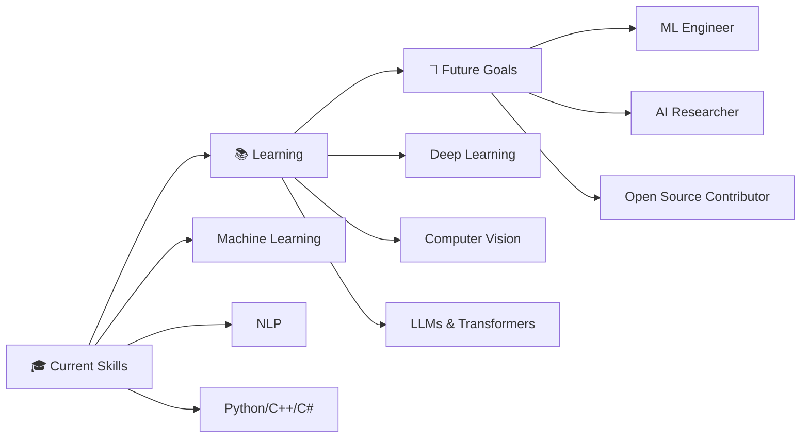

---

<div align="center">

### 🌟 **Thanks for stopping by!** 🌟


<p>
  
  
  
</p>

### ⭐ **Star my repositories if you find them useful!** ⭐

*"In the world of AI, the only constant is change. Keep learning, keep growing!"*


</div>

---

## 🎯 Current Goals & Learning Path

**🔭 What I'm Working On:**
- Building cutting-edge ML/DL projects
- Contributing to open-source AI initiatives
- Expanding expertise in Neural Networks
- Exploring Large Language Models & Transformers

**🎯 Career Objectives:**
- Securing a challenging ML/AI Engineering role
- Publishing research in AI/ML domain
- Building impactful AI solutions for real-world problems

<div align="center">



</div>

---

<div align="center">

### 🌟 **Thanks for stopping by!** 🌟


<p>
  
  
  
</p>

### ⭐ **Star my repositories if you find them useful!** ⭐

*"In the world of AI, the only constant is change. Keep learning, keep growing!"*


</div>## 🎯 Current Goals & Learning Path

<div align="center">


</div><div align="center">
  
</div>

<div align="center">
  
[](https://git.io/typing-svg)

<p>
  
  
  
  
</p>

</div>

---

## 👨‍💻 About Me

<details>
<summary><b>🔍 Click to learn more about me!</b></summary>

<br>

```python
class MachineLearningEngineer:
    def __init__(self):
        self.name = "Nada Mohammed Elbendary"
        self.role = "Machine Learning Engineer"
        self.location = "Egypt 🇪🇬"
        self.education = "Artificial Intelligence Student"
        self.status = "Third Year | Seeking ML/AI Opportunities"
        self.passion = ["AI", "Machine Learning", "Data Science", "Problem Solving"]
        
    def get_skills(self):
        return {
            "languages": ["Python", "C++", "C#", "JavaScript", "SQL"],
            "ml_frameworks": ["Scikit-learn", "TensorFlow", "PyTorch", "Pandas", "NumPy"],
            "specialization": ["NLP", "Sentiment Analysis", "Predictive Modeling", "Deep Learning"],
            "web_dev": ["Flask", "REST APIs", "ASP.NET", "HTML/CSS"],
            "tools": ["Git", "Jupyter", "VS Code", "Google Colab"],
            "cloud": ["Oracle Cloud Infrastructure"]
        }
    
    def current_focus(self):
        return [
            "🧠 Deep Learning & Neural Networks",
            "🤖 Large Language Models (LLMs)",
            "👁️ Computer Vision Applications",
            "🔍 Advanced NLP Techniques",
            "📊 Real-world ML Projects"
        ]
    
    def say_hi(self):
        print("Thanks for visiting! Let's connect and build something amazing! 🚀")

me = MachineLearningEngineer()
me.say_hi()
```

</details>

<div align="center">

### 🎯 Quick Facts

🎓 **Status:** Artificial Intelligence Student | Third Year  
🔬 **Currently Exploring:** Deep Learning & Transformer Architectures  
💼 **Open to:** ML/AI Engineering Internships & Entry-Level Roles  
🌟 **Passionate About:** Solving Real-World Problems with AI  
💡 **Fun Fact:** Always learning and building intelligent systems!  
📫 **Reach Me:** [nadaelbendary3@gmail.com](mailto:nadaelbendary3@gmail.com)

</div>

---

## 🛠️ Technology Arsenal

<div align="center">

### 💻 Programming Languages


### 🤖 ML/AI & Data Science


### 🌐 Web Development & APIs


### 🗄️ Databases


### 🔧 Tools & Platforms


### ☁️ Cloud & Enterprise


</div>

---

## 📊 Expertise Level

<div align="center">

| Skill | Proficiency | Bar |
|-------|-------------|-----|
| **Python** | Expert |  |
| **Machine Learning** | Advanced |  |
| **NLP & Text Analysis** | Advanced |  |
| **C++** | Proficient |  |
| **Flask/API Development** | Proficient |  |
| **JavaScript** | Intermediate |  |
| **Deep Learning** | Advanced |  |
| **Data Analysis** | Intermediate |  |

</div>

---

## 📈 GitHub Analytics

<div align="center">
  


</div>

---

## 🏆 Featured Projects

<div align="center">

### 🌟 Highlighted Work

</div>

<table>
<tr>
<td width="50%">

### 🧠 Amazon Sentiment Analysis System
**[View Repository →](https://github.com/nada-elbendary/Amazon-Sentiment-Analysis)**


**Advanced ML system for sentiment classification**

✨ **Key Features:**
- 🎯 91.13% classification accuracy
- 📊 Trained on 500K+ Amazon reviews
- 🚀 Real-time predictions via Flask API
- 💻 Modern responsive UI
- 🔧 TF-IDF vectorization & NLP preprocessing

**Tech Stack:**  
`Python` `Scikit-learn` `NLTK` `Flask` `Pandas` `NumPy`

</td>
<td width="50%">

### 🔮 More Projects Coming Soon!

**Currently Building:**
- 🤖 Computer Vision Applications
- 📝 Advanced NLP Systems
- 🧪 Deep Learning Experiments
- 📊 Data Analytics Dashboards

**Stay tuned for more exciting projects!**


*Check out my repositories for more projects and contributions!*

</td>
</tr>
</table>

---

## 📊 Contribution Activity

<div align="center">


</div>

---

## 🎯 Current Goals & Learning Path

**🔭 What I'm Working On:**
- Building cutting-edge ML/DL projects
- Contributing to open-source AI initiatives
- Expanding expertise in Neural Networks
- Exploring Large Language Models & Transformers

**🎯 Career Objectives:**
- Securing a challenging ML/AI Engineering role
- Publishing research in AI/ML domain
- Building impactful AI solutions for real-world problems

---

## 🤝 Let's Connect!

<div align="center">

<a href="https://www.linkedin.com/in/nada-mohammed5">
  
</a>
<a href="mailto:nadaelbendary3@gmail.com">
  
</a>
<a href="https://github.com/nada-elbendary">
  
</a>
<a href="#">
  
</a>

### 💬 Open to Collaborate On:

🤖 **Machine Learning Projects** | 🧠 **AI Research** | 📊 **Data Science** | 💼 **Internships & Entry-Level Opportunities**

</div>

---

## 💭 Inspirational Dev Quote

<div align="center">


</div>

---

## 🏅 Certifications & Achievements

<div align="center">

### 📜 Professional Certifications

<table>
<tr>
<td align="center" width="50%">

### 🤖 Oracle AI Foundations


**Artificial Intelligence & Machine Learning**

**💡 Key Competencies:**
- ✅ AI and ML fundamentals
- ✅ Deep Learning (CNNs, RNNs, LSTMs)
- ✅ Large Language Models (LLMs)
- ✅ Generative AI concepts
- ✅ Oracle Cloud Infrastructure (OCI)
- ✅ AI-powered business solutions

</td>
<td align="center" width="50%">

### 🌐 Huawei HCIA-AI


**AI & Intelligent Computing**

**💡 Key Competencies:**
- ✅ AI fundamentals & applications
- ✅ Machine Learning algorithms
- ✅ Deep Learning frameworks
- ✅ Neural network architectures
- ✅ AI model development
- ✅ Intelligent systems design

**🎖️ Additional:**
- Huawei iTB Recruitment Expo (HiRE6 - Oct 2025)

</td>
</tr>
</table>

<table>
<tr>
<td align="center">

### 💻 Full Stack .NET Developer


**Egypt Digital Pioneers Initiative - Rowad Masr**

**💡 Technical Skills & Knowledge:**

**Back-End Development:**
- ✅ Programming with C#
- ✅ .NET Core Web API
- ✅ ASP.NET Core MVC
- ✅ SQL Server for data-driven solutions

**Front-End Development:**
- ✅ HTML5, CSS3, JavaScript
- ✅ Responsive & interactive interfaces

**Software Engineering:**
- ✅ Functional Documentation
- ✅ Unit Testing
- ✅ Docker Containerization
- ✅ Git & GitHub

**Additional Skills:**
- ✅ Business English
- ✅ Coaching & Soft Skills
- ✅ Freelancing Essentials
- ✅ Prompt Engineering for AI tools

**📌 Capstone Project:** Integrated full-stack project from concept to deployment

</td>
</tr>
</table>

---

### 🎖️ Additional Achievements & Certifications

<table>
<tr>
<td align="center" width="50%">

### 🏆 McKinsey Forward Program
**McKinsey.org - Super Learner Badge 🎖️**

**Key Skills Developed:**
- 🔹 Critical thinking & structured problem-solving
- 🔹 Clear and empathetic communication
- 🔹 Purpose-driven leadership

</td>
<td align="center" width="50%">

### 🤖 AI Fundamentals
**IBM & Cisco Learning**

**Certifications:**
- ✅ AI Fundamentals - IBM
- ✅ AI Fundamentals - Learn with Cisco
- ✅ Machine Learning basics
- ✅ AI applications in industry

</td>
</tr>
</table>

### 📌 Certifications Overview

<p align="center">
  
  
  
</p>

<p align="center">
  
  
  
  
</p>

---

### 🏆 GitHub Trophies


</div>

---

<div align="center">

### 🌟 **Thanks for stopping by!** 🌟


<p>
  
  
  
</p>

### ⭐ **Star my repositories if you find them useful!** ⭐

*"In the world of AI, the only constant is change. Keep learning, keep growing!"*


</div>

---

<div align="center">
  
</div>
