<div align="center">
  
</div>

<div align="center">
  
[](https://git.io/typing-svg)

<p>
  
  
  
  
</p>

</div>

---

## 👨‍💻 About Me

```python
class MachineLearningEngineer:
    def __init__(self):
        self.name = "Nada Mohammed Elbendary"
        self.role = "Machine Learning Engineer"
        self.location = "Egypt 🇪🇬"
        self.education = "Computer Science Student"
        self.status = "Final Year | Seeking ML/AI Opportunities"
        self.passion = ["AI", "Machine Learning", "Data Science", "Problem Solving"]
        
    def get_skills(self):
        return {
            "languages": ["Python", "C++", "JavaScript", "SQL"],
            "ml_frameworks": ["Scikit-learn", "TensorFlow", "PyTorch", "Pandas", "NumPy"],
            "specialization": ["NLP", "Sentiment Analysis", "Predictive Modeling", "Deep Learning"],
            "web_dev": ["Flask", "REST APIs", "ASP.NET", "HTML/CSS"],
            "tools": ["Git", "Jupyter", "VS Code", "Google Colab"],
            "cloud": ["Oracle Cloud"]
        }
    
    def current_focus(self):
        return [
            "🧠 Deep Learning & Neural Networks",
            "🤖 Large Language Models (LLMs)",
            "👁️ Computer Vision Applications",
            "🔍 Advanced NLP Techniques",
            "📊 Real-world ML Projects"
        ]
    
    def say_hi(self):
        print("Thanks for visiting! Let's connect and build something amazing! 🚀")

me = MachineLearningEngineer()
me.say_hi()
```

<div align="center">

### 🎯 Quick Facts

🎓 **Status:** Computer Science Student | Final Year  
🔬 **Currently Exploring:** Deep Learning & Transformer Architectures  
💼 **Open to:** ML/AI Engineering Internships & Entry-Level Roles  
🌟 **Passionate About:** Solving Real-World Problems with AI  
💡 **Fun Fact:** Completed intensive 8-week ML bootcamp!  
📫 **Reach Me:** [nadaelbendary3@gmail.com](mailto:nadaelbendary3@gmail.com)

</div>

---

## 🛠️ Technology Arsenal

<div align="center">

### 💻 Programming Languages


### 🤖 ML/AI & Data Science


### 🌐 Web Development & APIs


### 🗄️ Databases


### 🔧 Tools & Platforms


### ☁️ Cloud & Enterprise


</div>

---

## 📊 Expertise Level

<div align="center">

| Skill | Proficiency | Bar |
|-------|-------------|-----|
| **Python** | Expert |  |
| **Machine Learning** | Advanced |  |
| **NLP & Text Analysis** | Advanced |  |
| **C++** | Proficient |  |
| **Flask/API Development** | Proficient |  |
| **JavaScript** | Intermediate |  |
| **Deep Learning** | Intermediate |  |
| **Data Analysis** | Intermediate |  |

</div>

---

## 📈 GitHub Analytics

<div align="center">
  


</div>

---

## 🏆 Featured Projects

<div align="center">

### 🌟 Highlighted Work

</div>

<table>
<tr>
<td width="50%">

### 🧠 Amazon Sentiment Analysis System
**[View Repository →](https://github.com/nada-elbendary/Amazon-Sentiment-Analysis)**


**Advanced ML system for sentiment classification**

✨ **Key Features:**
- 🎯 91.13% classification accuracy
- 📊 Trained on 500K+ Amazon reviews
- 🚀 Real-time predictions via Flask API
- 💻 Modern responsive UI
- 🔧 TF-IDF vectorization & NLP preprocessing

**Tech Stack:**  
`Python` `Scikit-learn` `NLTK` `Flask` `Pandas` `NumPy`

</td>
<td width="50%">

### 🔮 More Projects Coming Soon!

**Currently Building:**
- 🤖 Computer Vision Applications
- 📝 Advanced NLP Systems
- 🧪 Deep Learning Experiments
- 📊 Data Analytics Dashboards

**Stay tuned for more exciting projects!**


*Check out my repositories for more projects and contributions!*

</td>
</tr>
</table>

---

## 📊 Contribution Activity

<div align="center">


</div>

---

## 🎯 Current Goals & Learning Path

```mermaid
graph LR
    A[🎓 Current Skills] --> B[📚 Learning]
    B --> C[🚀 Future Goals]
    
    A --> A1[Machine Learning]
    A --> A2[NLP]
    A --> A3[Python/C++]
    
    B --> B1[Deep Learning]
    B --> B2[Computer Vision]
    B --> B3[LLMs & Transformers]
    
    C --> C1[ML Engineer]
    C --> C2[AI Researcher]
    C --> C3[Open Source Contributor]
```

<div align="center">



</div>

---

## 📚 My Learning Journey - 8-Week ML Intensive Bootcamp

<details>
<summary><b>🦝 Click to view complete 8-week curriculum!</b></summary>

<br>

### **Week 1 – Python Fundamentals & Data Libraries** 🐍
- ✅ Python Programming Review
- ✅ NumPy for Numerical Computing
- ✅ Pandas for Data Manipulation
- ✅ Matplotlib for Visualization
- ✅ Kaggle Platform Introduction

### **Week 2 – Statistics & Basic ML Algorithms** 📊
- ✅ Descriptive & Inferential Statistics
- ✅ Probability Theory
- ✅ K-Nearest Neighbors (KNN)
- ✅ Linear Regression & Gradient Descent
- ✅ Linear Algebra for ML

### **Week 3 – EDA & Model Optimization** 🔍
- ✅ Exploratory Data Analysis (EDA)
- ✅ Seaborn for Advanced Visualization
- ✅ Data Preprocessing Techniques
- ✅ Cross-Validation Methods
- ✅ Regularization (L1/L2)
- ✅ Locally Weighted Regression

### **Week 4 – Classification Algorithms** 🎯
- ✅ Logistic Regression
- ✅ Naive Bayes & Gaussian Discriminant Analysis
- ✅ Decision Trees & Ensemble Methods
- ✅ Random Forests
- ✅ Support Vector Machines (SVM)
- ✅ Kernel Methods

### **Week 5 – Neural Networks** 🧠
- ✅ Perceptron & Linear Models
- ✅ Neural Network Architecture
- ✅ Backpropagation Algorithm
- ✅ Debugging ML Models
- ✅ Error Analysis
- ✅ Implementing Neural Networks from Scratch

### **Week 6 – Advanced Techniques** ⚡
- ✅ Optimization Algorithms (Adam, RMSprop, etc.)
- ✅ Feature Selection & Engineering
- ✅ Boosting Algorithms (AdaBoost, XGBoost)
- ✅ TensorFlow Framework

### **Week 7 – Unsupervised Learning** 🔮
- ✅ K-Means Clustering
- ✅ Hierarchical Clustering
- ✅ DBSCAN (Density-Based Clustering)
- ✅ Evaluation Metrics for Clustering
- ✅ Dimensionality Reduction (PCA, t-SNE)
- ✅ Unsupervised Learning Project

### **Week 8 – Deep Learning Frameworks & Projects** 🚀
- ✅ PyTorch Framework
- ✅ TensorFlow vs PyTorch Comparison
- ✅ Custom Model Architectures
- ✅ Transfer Learning
- ✅ Model Optimization Techniques
- ✅ **Capstone Project:** Customer Churn Prediction
- ✅ **Capstone Project:** Image Classification

</details>

---

**🔭 What I'm Working On:**
- Building cutting-edge ML/DL projects
- Contributing to open-source AI initiatives
- Expanding expertise in Neural Networks
- Exploring Large Language Models & Transformers

**🎯 Career Objectives:**
- Securing a challenging ML/AI Engineering role
- Publishing research in AI/ML domain
- Building impactful AI solutions for real-world problems

---

## 🤝 Let's Connect!

<div align="center">

<a href="https://www.linkedin.com/in/nada-mohammed5">
  
</a>
<a href="mailto:nadaelbendary3@gmail.com">
  
</a>
<a href="https://github.com/nada-elbendary">
  
</a>
<a href="#">
  
</a>

### 💬 Open to Collaborate On:

🤖 **Machine Learning Projects** | 🧠 **AI Research** | 📊 **Data Science** | 💼 **Internships & Entry-Level Opportunities**

</div>

---

## 💭 Inspirational Dev Quote

<div align="center">


</div>

---

## 🏅 Certifications & Achievements

<div align="center">

### 📜 Professional Certifications

<table>
<tr>
<td align="center" width="33%">

### 🔶 Oracle Certifications


**Database & Technology**
- Oracle Database Foundations
- Oracle Cloud Infrastructure
- Advanced Database Management

</td>
<td align="center" width="33%">

### 🌐 Huawei HCIA


**Networking & ICT**
- HCIA Certification
- Huawei Career Conference
- Network Infrastructure

</td>
<td align="center" width="34%">

### 💻 Full Stack .NET Developer


**Egypt Digital Pioneers Initiative**
- ASP.NET Development
- Full Stack Web Development
- Enterprise Applications

</td>
</tr>
</table>

### 🎖️ Additional Achievements


---

### 🏆 GitHub Trophies


</div>

---

<div align="center">

### 🌟 **Thanks for stopping by!** 🌟


<p>
  
  
  
</p>

### ⭐ **Star my repositories if you find them useful!** ⭐

*"In the world of AI, the only constant is change. Keep learning, keep growing!"*


</div>

---

<div align="center">
  
</div>
